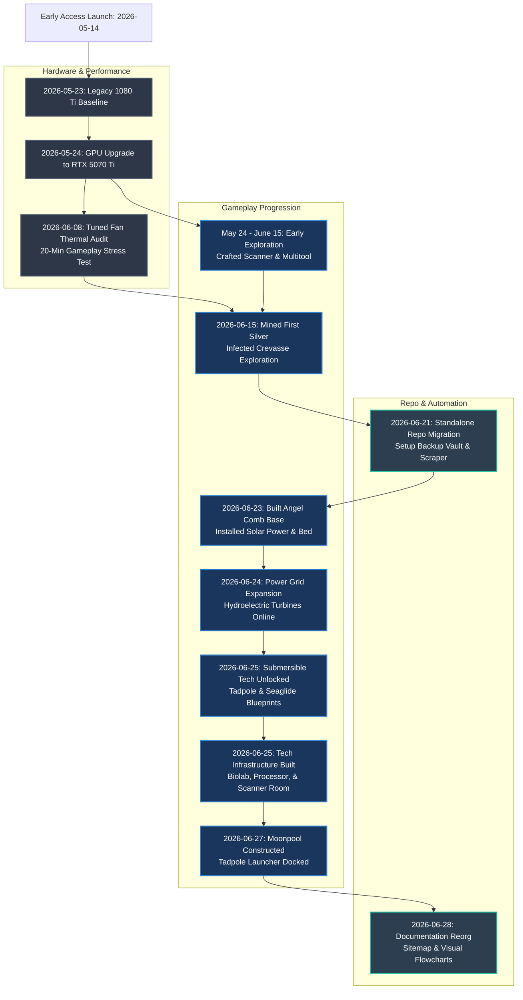

# Subnautica 2 Changelog

[Sitemap](SITEMAP.md) | [Guide](GUIDE.md) | [Roadmap](TODO.md) | [Changelog](CHANGELOG.md)

Primary chronological ledger recording gameplay coaching sessions, remote snapshots (`192.168.0.100`), vault backups (`backups/`), and live SaveGame inspections (`savegame_1.sav`). Organized in reverse-chronological order.

## 🗺️ Journey Progression Timeline

## 📋 Chronological Ledger

| Date | Milestone | Summary | Status |
| :--- | :--- | :--- | :--- |
| **2026-06-28 21:30:00** | Visual Timelines, Progression Flowcharts & Multiplayer Reorg | Added Mermaid journey timeline to [CHANGELOG.md](CHANGELOG.md), progression flowchart to [GUIDE.md](GUIDE.md), and a detailed "Pass the Torch" sequence diagram to [MULTIPLAYER.md](MULTIPLAYER.md). Integrated historical pre-organization sessions (GPU upgrade benchmarks). | **Verified**: Documents compiled and formatted. |
| **2026-06-27 10:30:00** | Base Expansion, Moonpool & Vehicle Launcher | Constructed Moonpool and Moonpool Dock (Tadpole Launcher). Added Battery Charger, Power Wall, and other base infrastructure. Crafted Air Bladder (`BP_AirBladder`). Scanned blueprints for Angled Room and Hatch. Checked off HUD beacon triage for cleared zones (Wu Lianghai, Old Habitat, Blackbox - Ruby, Camp One). | **Verified**: Save telemetry and user confirmation. |
| **2026-06-25 23:27:00** | Biolab, Processor & Hydro Power Grid Expansion | Crafted Sonic Resonator. Built Biolab, Processor (refined Titanium Ingot & Germanium Ingot), and Scanner Station. Expanded base power with 3x Hydroelectric Turbines, 2x Power Transmitters, and 6x Solar Panels. Discovered Tadpole Pens narrative investigation story goal. | **Verified**: User progress update & telemetry verification. |
| **2026-06-25 22:59:00** | Tadpole & Seaglide Unlocked | Unlocked Seaglide and Tadpole Submersible (`BP_Tadpole`). Updated remaining in-progress blueprint fragment status: Repair Tool (2/3), Wall Rack (1/3), Work Light (1/2), and Dive Elevator (1/2). | **Verified**: User progress update. |
| **2026-06-24 00:50:00** | Hydroelectric Turbine & Power Transmitter Unlocked | Unlocked Hydroelectric Turbine (`HydroelectricTurbine`) and Power Transmitter (`BP_PowerTransmitter`). Scouted and cleared Blackbox - Ruby (set Beacon to Green & OFF). Captured partial blueprint fragments for Power Cell (`BP_PowerCell` 1 unit) and Dive Elevator (`BP_DiveElevator` 1 unit). | **Verified**: Manual PDA inspection & telemetry alignment. |
| **2026-06-23 23:55:00** | Scanner Station, Wu Lianghai & Rapid Sweep Circuit | Constructed exterior Scanner Room (`BP_ScannerRoom`) at Angel Comb base. Scouted and cleared Wu "Wu" Lianghai signal (set Beacon to Green). Updated in-progress blueprint fragment status (Repair Tool 1/3, Tadpole 2/3, Bioreactor 2/3, Hydroelectric Turbine 1/3, Wall Rack 1/3). Created rapid wreckage sweep circuit in `TODO_ASAP.md`. | **Verified**: Manual PDA inspection & telemetry alignment. |
| **2026-06-23 23:05:00** | Wake Maker, Biolab & Near-Term Blueprint Mapping | Constructed Wake Maker, interior Fabricator, Biomass Processor, Biolab, Biobed, ~5 Solar Panels, and Habitat Beacon. Mapped partial near-term in-progress blueprint status (Repair Tool 1/3, Bioreactor 1/3, Dining Chair 1/3, Tadpole 2/3, Hydroelectric Turbine 2/3). Established Signals management SOP to triage active investigation beacons. | **Verified**: Manual PDA inspection & telemetry alignment. |
| **2026-06-23 17:10:00** | Documentation Architecture Reorg & Telemetry Expansion | Consolidated static progression guidance into standalone `GUIDE.md`, keeping dynamic SaveGame state strictly in `REPORT.md` and actionable checklists in `TODO.md`. Added 3D spatial coordinate extraction (`X, Y, Z`) to Python decoder. Integrated official dev links (Steam News, Kanban, Unknown Worlds) and beginner survival principles. Expanded validation test suite. | **Verified**: 100% passing tests & formatting. |
| **2026-06-23 16:48:00** | Standalone Roadmap & Verification SOP | Split reverse-chronological coaching roadmap out of `README.md` into standalone `TODO.md`. Added systematic **Exploration Verification SOP** to track and close out perimeter destinations (Welcome Center BioLab, Black Box, Basecamp). Synchronized latest remote save vault via `make pull && make report`. | **Verified**: Roadmap and telemetry updated. |
| **2026-06-23 16:45:00** | Starter Base Construction & Solar Power | Constructed starter habitat base near Angel Comb / Coral Gardens (`CoralGardens`). Installed ~5 Solar Panels on roof for renewable power and interior O₂ generation. Deployed interior Bed (`BioBed`) and Wall Lockers (`BP_WorldSupplyLocker`) stocked with gathered Silver, Titanium, Copper, and Quartz. | **Verified**: Save inspection confirms base modules. |
| **2026-06-21 19:15:00** | Dedicated Telemetry Report | Merged master coaching guide and action roadmaps into `README.md`. Reconfigured `subnautica_scraper.py` to output live progression telemetry and GameUserSettings.ini engine profiles into dedicated `REPORT.md`. Removed obsolete `subnautica.md`. | **Verified**: Telemetry report operational. |
| **2026-06-21 18:57:00** | Standalone Repository Migration | Relocated all Subnautica 2 telemetry scrapers, Makefiles, backup vaults (`backups/`), and markdown guides out of parent `pc-build` homelab repository into standalone `subnautica-2` repository. Reconfigured relative path constants across scripts. | **Verified**: Standalone toolkit operational. |
| **2026-06-21 16:08:48** | Flat Backup Vault & Binary Decoder | Created bi-directional file sync bridge (`sync_remote_vault.py`) storing binary saves, engine logs, and plaintext INIs flat in `backups/`. Built de-junked binary decoder (`decode_sav.py`) converting raw `savegame_*.sav` files into clean markdown guides. | **Verified**: Synchronized 11 binary saves locally. |
| **2026-06-21 15:52:49** | Chat Archive & Local Log Integration | Replaced raw web chat UI noise with engineering archive (`subnuatica_2_previous_chat.md`). Configured automatic local dumping of remote engine logs (`Subnautica2.log`) on every report run. | **Verified**: Tracking remote commit `4df49f6`. |
| **2026-06-21 15:47:26** | Remote Git Rollback Engine | Initialized Git repository directly on remote gaming rig inside `C:/Users/jake/AppData/Local/Subnautica2/Saved/.git/` with custom `.gitignore` blocking heavy `.bak` auto-backups and shader caches. | **Verified**: Baseline commit `4df49f6` guarding saves. |
| **2026-06-21 15:45:00** | Telemetry Scraper & Makefile Setup | Initialized progression scraper (`subnautica_scraper.py`) tracking remote Windows Unreal Engine 5 save state over SSH (`192.168.0.100`). Added developer `Makefile` automating progression polling (`make report`) and vault syncing. | **Verified**: Extracted inventory and equipment telemetry. |
| **2026-06-15 14:20:00** | Historical Chat Baseline | Early interactive chat coaching session analyzing initial gameplay discovery. Scouted ~239m West into Infected Crevasse near Infected Angel Bloom, mined Silver ore veins, gathered starter ore, and planned starter habitat base construction. | **Archived**: Documented in `subnuatica_2_previous_chat.md`. |
| **2026-06-08 21:34:16** | Tuned Fan Curves Gameplay Stress Test | Played a 20-minute real-world gameplay session to audit thermal performance of the newly tuned BIOS fan curves. Peak GPU temperature stabilized at 67.9°C (motherboard temperature at 41.0°C). | **Verified**: Telemetry log `PC_2026-06-08_21-34-16_Subnautica2_gameplay_stress_tuned.csv`. |
| **2026-05-24 to 2026-06-15** | Early Exploration Phase (Unorganized) | Played ~4 hours of unorganized exploration. Crafted basic Scanner and Multitool (Habitat Builder) while scouting shallow areas. | **Unorganized**: No telemetry or structured logs. |
| **2026-05-24 23:46:00** | RTX 5070 Ti Upgrade & Subnautica 2 Benchmark | Upgraded gaming rig to RTX 5070 Ti. Ran first gameplay benchmark on the new GPU to verify performance. | **Verified**: Telemetry log `PC_2026-05-24_Subnautica2_5070ti.csv`. |
| **2026-05-23 23:01:00** | Legacy GTX 1080 Ti Benchmark | Ran baseline gameplay benchmark on the legacy GTX 1080 Ti before hardware swap. | **Verified**: Telemetry log `PC_2026-05-24_Subnautica2_1080ti.csv`. |
