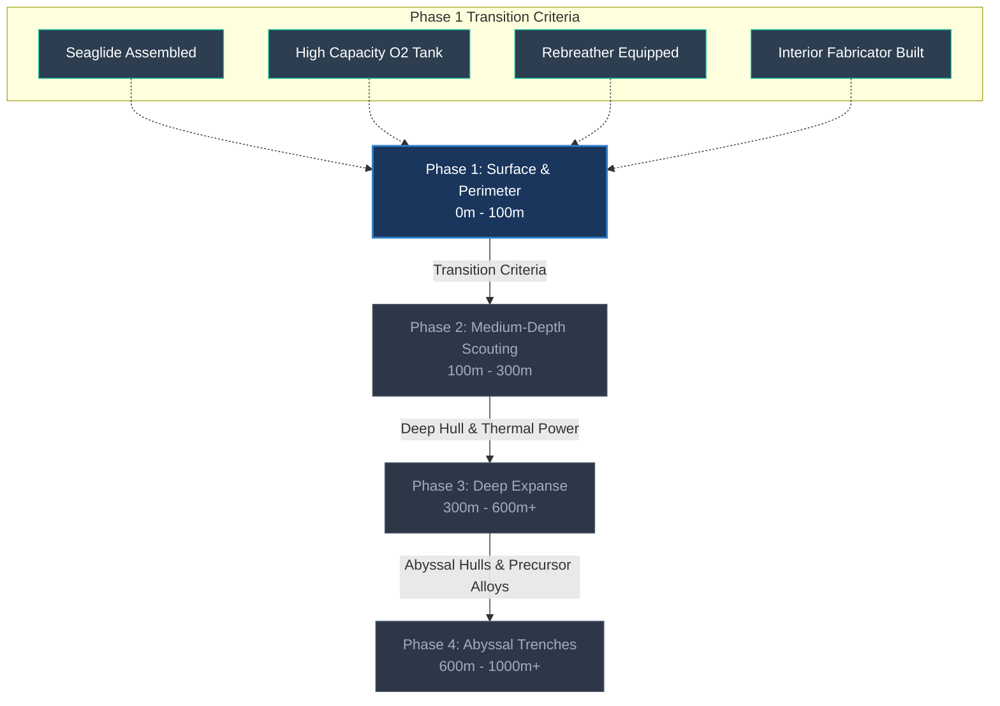

# Subnautica 2 Progression Guide

A clinical progression guide, geographic biome compendium, and new-player coaching manual for **Subnautica 2** (Early Access Standalone / Unreal Engine 5).

All telemetry and biome coordinates verified via live SSH SaveGame inspection (`192.168.0.100` | `savegame_1.sav`).

---

## 🌟 Core Survival Principles

Curated community wisdom and essential beginner mechanics (strictly filtered to prevent narrative storyline spoilers):
- **The "Rule of Three" (Power & Oxygen Security)**: Always maintain at least +2 surplus Solar Panels (`BP_SolarPanel`) or a secondary power generator before building heavy appliances (like Water Filtration or Scanner Rooms). Running out of base energy at night completely stops interior life-support oxygen generation!
- **Beacon Discipline**: Craft Beacons (`BP_Beacon`) early using Copper + Titanium. Deploy and clearly label them at perimeter resource drops (e.g., "Deep Sandstone Shelf - Gold/Dia", "Kelp Trench - Seed Pods", "Basecamp Entrance") so you never waste daylight or O₂ hunting for narrow canyon openings.
- **Scanner Room Overdrive**: Attaching an adjacent Scanner Room (`BP_ScannerRoom`) and equipping it with 4x Range Upgrades transforms your starter base into an automated radar network, highlighting local limestone/sandstone nodes and unmapped wreck fragments through canyon walls.
- **Stow Before You Go**: Dedicate 1 empty Wall Locker entirely to quick-drop loot. Before scouting perimeter wreckage (>400m away), deposit all non-essential ores and spare tools so you have 100% free inventory slots for Titanium salvage and tech blueprints.
- **Dive Envelope Discipline**: Never descend below your current oxygen tank's comfortable dive envelope (100m depth for Standard Tank) without a Rebreather and a Seaglide. Swimming vertically without a submersible vehicle consumes excessive oxygen during emergency ascents.
- **HUD Signal Triage**: Keep core reference beacons active (**Lifepod**, **Angel Comb Base**, custom Beacons) in your PDA Signals menu, but disable investigated wreckage and cleared story signals (**Welcome Center**, **Blackbox** beacons, **Camp One**) once fully scouted so your compass remains clean.

---

## 🪜 High-Level Progression Sequence (Spoiler-Free)

A macro-level sequence of major progression tiers across the game. For immediate actionable execution checklists and specific item targets, refer to [TODO.md](./TODO.md).

### 1. Phase 1: Surface & Perimeter Survival (0-100m) *(Current Phase)*
- **Core Objectives**: Establish starter habitat base (Angel Comb), craft core hand tools (`BP_Builder`, `BP_RepairTool`, `BP_LaserCutter`), equip depth survival gear (High Capacity O₂ Tank, Rebreather), assemble your rapid traversal vehicle (`BP_Seaglide`), and verify 100% blueprint capture across nearby Alterra emergency beacons.
- **Primary Bottleneck**: O₂ capacity and manual swimming speed.

### 2. Phase 2: Medium-Depth Scouting & Submersible Assembly (100m-300m)
- **Core Objectives**: Construct a **Mobile Vehicle Bay** (`BP_MobileVehicleBay`) to assemble your first enclosed submersible vehicle. Establish forward scanner outposts in medium-depth canyons (e.g., Twisty Bridges, Lilypad Islands) and harvest intermediate pressure-depth minerals (Magnetite, Lithium, Diamonds) to craft submersible modification upgrades.
- **Primary Bottleneck**: Submersible pressure depth ratings and base power grid scaling.

### 3. Phase 3: Deep Expanse & Alien Infrastructure (300m-600m+)
- **Core Objectives**: Upgrade submersible hulls with reinforced depth modules. Construct thermal plant outposts near hydrothermal volcanic vents (`BP_ThermalPlant`) to sustain deep research facilities. Investigate deep unmapped alien architectural structures and harvest rare deep-sea botanical samples.
- **Primary Bottleneck**: Extreme thermal environmental damage and navigation in complex cavern networks.

### 4. Phase 4: Abyssal Trenches & Endgame Synthesis (600m-1000m+)
- **Core Objectives**: Deploy heavy industrial submersibles into abyssal magma ravines. Synthesize advanced precursor alloys, unlock advanced depth blueprints, and complete main narrative objectives.

---

## 🧭 Perimeter Destination Compendium

Detailed geographic compendium for all 7 primary early-game zones near your origin Lifepod.

| Zone / Landmark | Approx Depth | Distance & Direction from Pod | Relative to Angel Comb Base | Core Verification Targets |
| :--- | :--- | :--- | :--- | :--- |
| **1. Emergency Pod** | `~0m` | Origin (`X: 0m, Y: 0m`) | `~238m East` | Initial survival tools (`BP_Scanner`, `BP_Builder`), Standard O₂ Tank, Knife. |
| **2. Angel Comb Base** | `~30m` | `~238m West` (`X: 0.1m, Y: -237.8m W`)| Core Reference Point | Multipurpose Room, Hatch, Bed (`BioBed`), 5 Solar Panels, Wall Lockers. |
| **3. Crashed Black Box** | `~45m` | `~380m North` | `~250m Northeast` | Light Stick / Floodlight fragments, Bar Table/Bench blueprints, Audio Log. |
| **4. Welcome Center Lab**| `~60m` | `~500m Northwest` | `~300m North-Northwest` | BioLab Counters, Specimen Analyzer, Chemical Lockers, High Cap O₂ terminal. |
| **5. Abandoned Basecamp**| `~70m` | `~420m West` | `~180m West` | Multipurpose Room fragments, Exterior Growbed, Battery Charger fragments (2). |
| **6. Kelp Forest Border**| `~50m-90m` | `~250m-400m West / Southwest` | Directly South & Adjacent | **Seaglide** fragments (3), Mobile Vehicle Bay fragments, Creepvine Seed Pods. |
| **7. Thermal Hydro Vents**| `~80m-120m`| `~450m Northeast / East` | `~550m East-Northeast`| Thermal Plant tech, Power Transmitters (`BP_PowerTransmitter`), Lithium / Mag nodes.|

### Exploration Verification SOP ("Closing Out" Zones)
Before marking any biome or Alterra signal as **Closed (100% Explored)**:
1. **Sweep & Scan**: Check all cargo crates, datapad terminals, and scattered debris.
2. **Verify Blueprints**: Check your PDA Blueprints tab (`::Unlocked`) to ensure no partial fragment bars remain (e.g., 1/2 or 2/3).
3. **Save Telemetry Validation**: Run `make report` to confirm StoryGoal registration in `savegame_1_decoded.md`.

---

## 🚀 Transition Criteria: When to Move On

You are ready to transition from perimeter surface scouting (0-100m) to medium-depth exploration (100m-250m+, e.g. **Twisty Bridges**, **Deep Coral Gardens**, **Deep Thermal Ravines**) as soon as the following 5 transition benchmarks are achieved:
1. **Seaglide Assembled**: For rapid transit and maneuvering against strong underwater currents.
2. **High Capacity O₂ Tank Equipped**: (+90 max O₂) providing extended dive endurance below 100m.
3. **Rebreather Installed**: Eliminating heavy deep-water oxygen consumption penalties.
4. **Interior Fabricator Built**: Enabling independent base crafting without returning to the emergency lifepod.
5. **Perimeter Blueprints Closed Out**: All scan targets in the Perimeter Biome Matrix are verified complete.

---

## 🔗 External Knowledge

- **Subnautica 2 Steam News Hub**: [store.steampowered.com/news/app/1962700](https://store.steampowered.com/news/app/1962700)
- **Official Dev Kanban Board**: [subnautica2.nolt.io/kanban](https://subnautica2.nolt.io/kanban)
- **Official Site News Portal**: [unknownworlds.com/en/news](https://unknownworlds.com/en/news)
- **Subnautica 2 Official Wiki**: [subnautica.fandom.com/wiki/Subnautica_2](https://subnautica.fandom.com/wiki/Subnautica_2)
- **Subnautica 2 Interactive Map**: [subnauticamap.io](https://subnauticamap.io)
- **Beginner Survival & Crafting Guide**: [subnautica.fandom.com/wiki/Beginner%27s_Guide](https://subnautica.fandom.com/wiki/Beginner%27s_Guide)
- **Official Subnautica Website**: [subnautica.com](https://subnautica.com)
