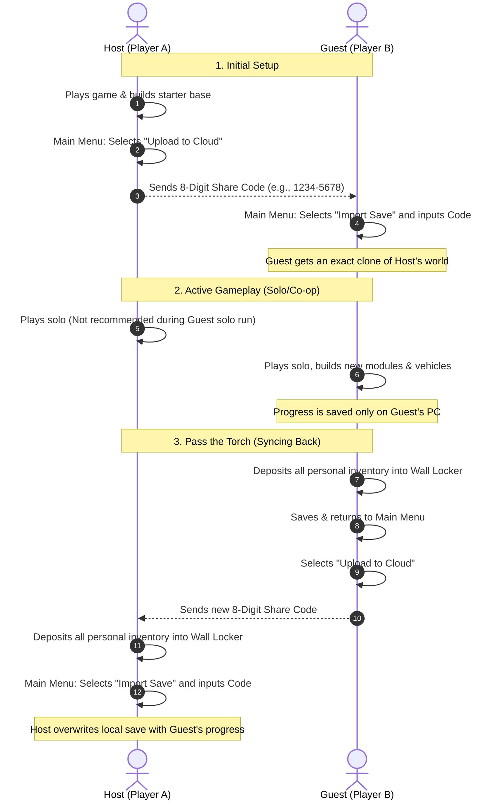

# Subnautica 2 Multiplayer & Save Synchronization Guide

Comprehensive operational guidelines, cloud synchronization semantics, and save hygiene protocols for **Subnautica 2** (Early Access Standalone / Unreal Engine 5).

---

## ☁️ Cloud Sharing Semantics

The built-in cloud-share engine in *Subnautica 2* is an asynchronous **manual snapshot (copy/paste) utility**, not a live cloud-synchronized lobby. Builds and world changes **will not automatically sync** across Steam accounts or separate gaming rigs in real time.

### The "Pass the Torch" Visual Protocol



---

## 📋 Step-by-Step Operations Checklist

Follow these steps exactly to progress a shared world without losing items or desyncing progress:

### For the Active Builder (The "Torch-Holder")
1. **Play and Progress**: Complete your gameplay session. Build rooms, gather resources, or craft vehicles.
2. **Locker Drop (CRITICAL)**: Before saving, swim to your base and **deposit 100% of your inventory** (including equipped tools like the Scanner, Builder, Seaglide, and equipped gear like Fins/Tanks) into a designated base Wall Locker.
3. **Save & Exit**: Save your game and exit to the main menu.
4. **Generate Code**: Click **"Upload to Cloud"** on the save slot to get a new 8-digit share code.
5. **Transmit Code**: Send the 8-digit code to the other player.

### For the Receiving Player
1. **Receive Code**: Wait for the active builder to send the new 8-digit code.
2. **Locker Drop (CRITICAL)**: If you have an active local copy of the world, load it, deposit your entire inventory into a base Wall Locker, save, and return to the main menu.
3. **Import Save**: Select **"Import Save"** from the main menu and input the 8-digit code.
4. **Retrieve Gear**: Spawn in the world, swim to the base locker, retrieve your gear, and begin your session as the new Torch-Holder.

---

## ⚠️ Inventory Preservation Checklist
> [!CAUTION]
> **Early Access Inventory Reset Bug**
> Cloud imports in the current Early Access build frequently reset personal inventories or respawn characters at the starter Emergency Lifepod with empty pockets. **Always deposit all gear, raw materials, and equipped hand tools into a base Wall Locker before uploading or importing cloud codes.**

- [ ] **Hand Tools**: Scanner, Habitat Builder, Repair Tool, Laser Cutter.
- [ ] **Equipped Gear**: High Capacity O₂ Tank, Fins, Rebreather, Compass.
- [ ] **Quick-Slot Items**: Flashlight, Flares, Air Bladder.
- [ ] **Resources**: Silver, Titanium, Copper, Quartz, and food/water.

---

## 📁 Local Save Directory & Manual Backups

If you want to perform manual file backups or inspect your saves:

### Windows Save Path
```text
C:\Users\<Your-Username>\AppData\Local\Subnautica2\Saved\SaveGames\
```
* **Active Save File**: [savegame_1.sav](file:///C:/Users/jake/AppData/Local/Subnautica2/Saved/SaveGames/savegame_1.sav) (Slot 1)
* **Backup Files**: `savegame_1_0.bak` through `savegame_1_9.bak` (automatically rotated by the engine)

### Automated Backups (Using this Repository)
You can use the local scraper toolkit in this repository to automate your save game backups:
* **Pull Remote Saves**: Run `make pull` (or `python3 subnautica_scraper.py --pull`) to mirror all remote saves and configuration files into the local [backups/](backups/) folder.
* **Inspect Progression**: Run `make report` to decode the binary save file and compile a progress report in [REPORT.md](REPORT.md).
